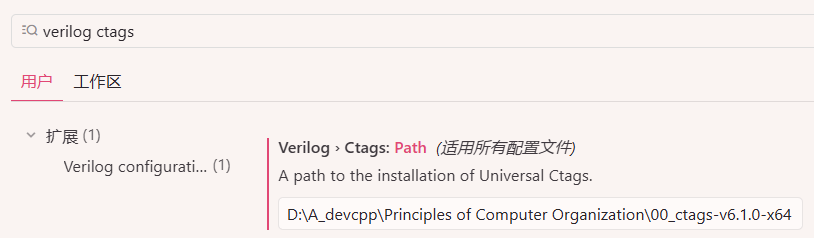

2025 年 XJTU 计算机组成原理实验

# 环境配置

我用的是 vs-code 系编辑器

在插件里搜索 `Verilog`，下载这个插件

现在我们就有语法高亮了

---

接下来配置 Linting，虽然这个插件支持 modelsim，但是笔者测下来有 bug，故决定用其他的

xvlog 需要安装 Vivado，过于臃肿；verilog 在 Windows 下很难安装；所以笔者采用 **iverilog**

<https://bleyer.org/icarus/>

---

然后配置 ctags，在 <https://github.com/universal-ctags/ctags-win32> 的 release 里下载

笔者下的是 `ctags-v6.1.0-x64.zip`，找个文件夹解压，然后在设置里填入路径

# 单周期

