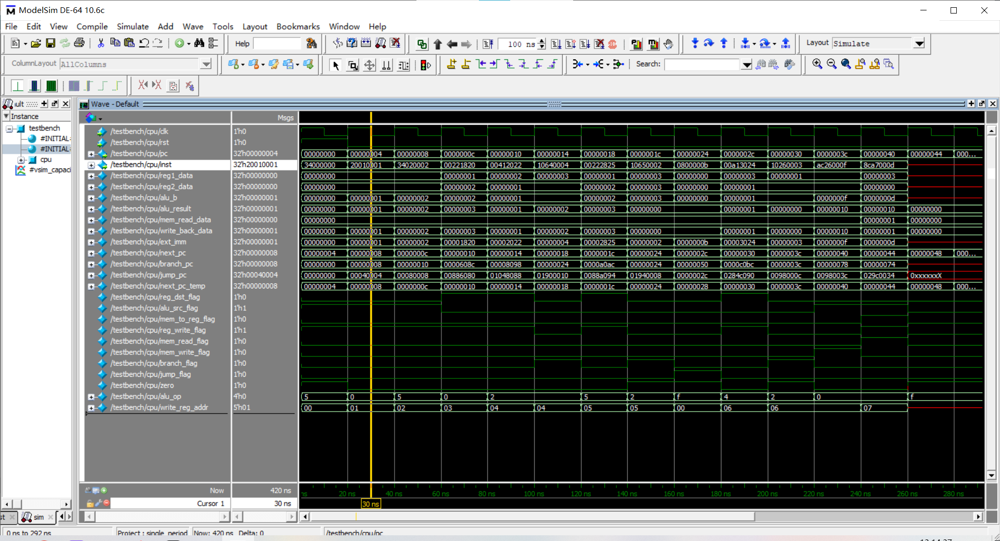
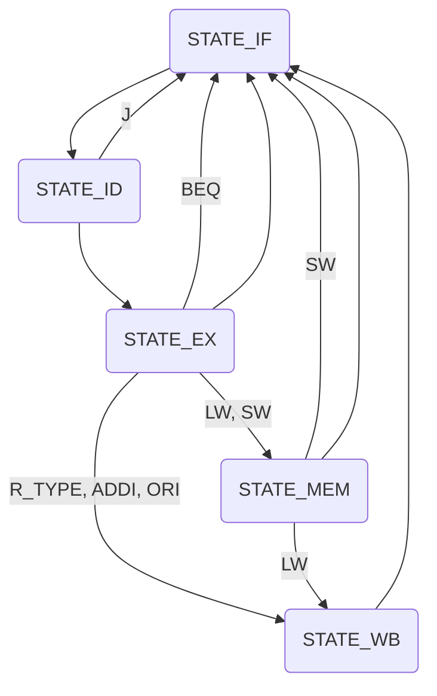
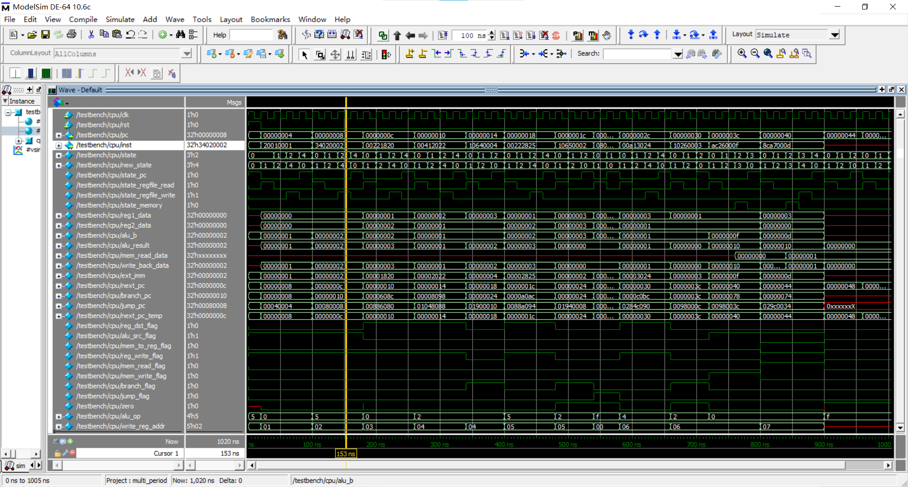
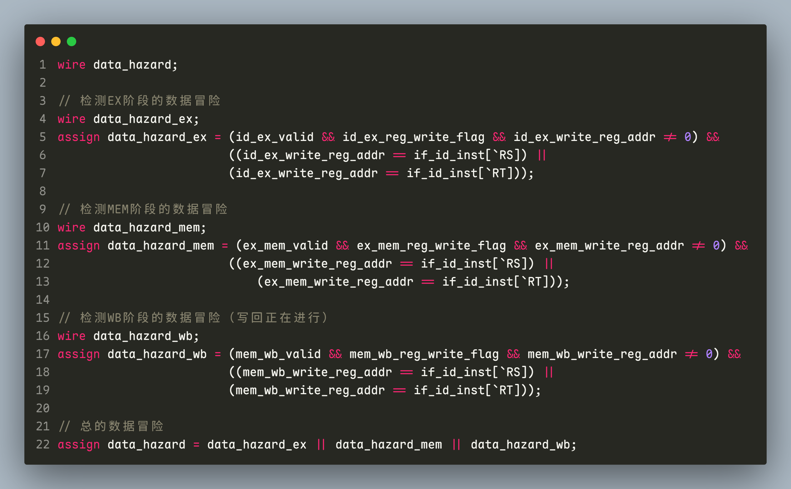
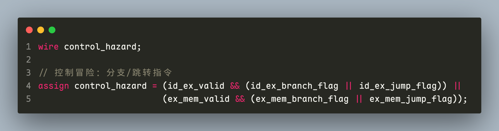
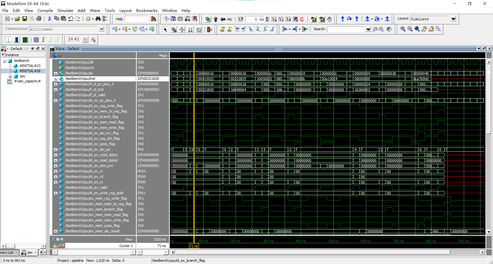

# <center>西安交通大学实验报告</center>

<font face="黑体">课程名称：</font><font face="楷体"><u>计算机组成原理</u></font><font face="黑体">     实验名称：</font><font face="楷体"><u>设计单周期、多周期和流水线CPU</u></font>

<font face="黑体">学院：</font><font face="楷体"><u>电信学部</u></font>				<font face="黑体">实验日期：2025年12月</font>

<font face="黑体">姓名：</font><font face="楷体"><u>姜宇骋</u></font>					<font face="黑体">班级：</font><font face="楷体"><u>计试2301</u></font>			<font face="黑体">学号：</font><font face="楷体"><u>2213315464</u></font>

**诚信承诺：我保证本实验报告中的程序和本实验报告是我自己编写，没有抄袭。**

---

<font size=5><b>目录</b></font>

[TOC]

---

<div STYLE="page-break-after: always;"></div>

## 1 单周期CPU

从 MIPS-C 指令集中选择了 10 条，**地址总线** 和 **数据总线** 均为 32 位

### 1.1 指令选择

#### 1.1.1 R-R 运算指令 4 条

```assembly
add
sub
and
or
```


#### 1.1.2 R-I 运算指令 2 条

```assembly
addi
ori
```


<div STYLE="page-break-after: always;"></div>

#### 1.1.3 分支指令 2 条

```assembly
beq
j
```


#### 1.1.4 加载指令 1 条

```assembly
lw
```


#### 存储指令 1 条

```assembly
sw
```


（上图描述的有误，我的代码实现是 `GPR[rt] -> memory[GPR[base]+offset]`）

### 1.2 表格汇总

| 文件                | 功能                         |
| ------------------- | ---------------------------- |
| defines.v           | 一些常量的定义               |
| pc.v                | 程序计数器                   |
| mux2.v              | 二路选择器                   |
| sign_extender.v     | 有符号数扩展（16位 -> 32位） |
| alu.v               | alu 运算单元                 |
| register_file.v     | 寄存器定义，初始清零         |
| inst_memory.v       | 指令定义，硬编码测试指令     |
| data_memory.v       | 数据定义，初始内存清零       |
| control_unit.v      | 分析指令                     |
| single_period_cpu.v | 内部信号连接                 |

### 1.3 测试指令

```assembly
ori  $r0, $r0, 0    // 占位
addi $r0, $r1, 1    // 把 $r1 设为 0+1, $r1 期望为 1
ori  $r0, $r2, 2    // 把 $r2 设为 0|2, $r2 期望为 2
add  $r1, $r2, $r3  // 把 $r3 设为 $r1+$r2, $r3 期望为 3
sub  $r2, $r1, $r4  // 把 $r4 设为 $r2-$r1, $r4 期望为 1
beq  $r3, $r4, 4    // 比较 $r3 和 $r4, 期望不跳转, 执行下一条指令
or   $r1, $r2, $r5  // 把 $r5 设为 $r1|$r2, $r5 期望为 3
beq  $r3, $r5, 2    // 比较 $r3 和 $r5, 期望跳转, 跳过下一条指令
j    0              // 跳转到开头, 期望被跳过, 不执行
j    11             // 期望跳过下一条指令
j    0              // 跳转到开头, 期望被跳过, 不执行
and  $r5, $r1, $r6  // 把 $r6 设为 $r5&$r1, $r6 期望为 1
beq  $r1, $r6, 3    // 比较 $r1 和 $r6, 期望跳转, 跳过下两条指令
j    0              // 跳转到开头, 期望被跳过, 不执行
j    0              // 跳转到开头, 期望被跳过, 不执行
sw   $r1, $r6, 15   // 把 $r6 存到 mem[$r1+15], 期望在 0x04 处写入 1
lw   $r5, $r7, 13   // 把 $r7 设为 mem[$r5+13], $r7 期望为 1
```

翻译成二进制

```verilog
inst_mem[0]  = 32'b001101_00000_00000_0000_0000_0000_0000;
inst_mem[1]  = 32'b001000_00000_00001_0000_0000_0000_0001;
inst_mem[2]  = 32'b001101_00000_00010_0000_0000_0000_0010;
inst_mem[3]  = 32'b000000_00001_00010_00011_00000_100000;
inst_mem[4]  = 32'b000000_00010_00001_00100_00000_100010;
inst_mem[5]  = 32'b000100_00011_00100_0000_0000_0000_0100;
inst_mem[6]  = 32'b000000_00001_00010_00101_00000_100101;
inst_mem[7]  = 32'b000100_00011_00101_0000_0000_0000_0010;
inst_mem[8]  = 32'b000010_0000_0000_0000_0000_0000_0000_00;
inst_mem[9]  = 32'b000010_0000_0000_0000_0000_0000_0010_11;
inst_mem[10] = 32'b000010_0000_0000_0000_0000_0000_0000_00;
inst_mem[11] = 32'b000000_00101_00001_00110_00000_100100;
inst_mem[12] = 32'b000100_00001_00110_0000_0000_0000_0011;
inst_mem[13] = 32'b000010_0000_0000_0000_0000_0000_0000_00;
inst_mem[14] = 32'b000010_0000_0000_0000_0000_0000_0000_00;
inst_mem[15] = 32'b101011_00001_00110_0000_0000_0000_1111;
inst_mem[16] = 32'b100011_00101_00111_0000_0000_0000_1101;
```

因为 modelsim 里是十六进制展示的，所以在翻译成十六进制

```verilog
inst_mem[0]  = 32'h34000000;  // ori, 占位
inst_mem[1]  = 32'h20010001;  // addi, 执行
inst_mem[2]  = 32'h34020002;  // ori, 执行
inst_mem[3]  = 32'h00221820;  // add, 执行
inst_mem[4]  = 32'h00412022;  // sub, 执行
inst_mem[5]  = 32'h10640004;  // beq, 执行, 不跳转
inst_mem[6]  = 32'h00222825;  // or, 执行
inst_mem[7]  = 32'h10650002;  // beq, 执行, 跳转
inst_mem[8]  = 32'h08000000;  // 被跳过
inst_mem[9]  = 32'h0800000B;  // j, 执行, 跳过
inst_mem[10] = 32'h08000000;  // 被跳过
inst_mem[11] = 32'h00A13024;  // and, 执行
inst_mem[12] = 32'h10260003;  // beq, 执行, 跳转
inst_mem[13] = 32'h08000000;  // 被跳过
inst_mem[14] = 32'h08000000;  // 被跳过
inst_mem[15] = 32'hAC26000F;  // sw, 执行
inst_mem[16] = 32'h8CA7000D;  // lw, 执行
```

### 1.4 控制信号解释

| 信号名              | 用途                                                     |
| ------------------- | -------------------------------------------------------- |
| `reg_dst_flag`    | 0: 写入 `rt` 或者无作用<br />1: 写入 `rd`            |
| `alu_src_flag`    | 0: 从寄存器获取 `alu_b`<br />1: 从立即数获取 `alu_b` |
| `mem_to_reg_flag` | 1: 从内存读取值赋给寄存器                                |
| `reg_write_flag`  | 1:`write_back_data` 赋给寄存器                         |
| `mem_read_flag`   | 1: 从内存读取值                                          |
| `mem_write_flag`  | 1: 往内存写值                                            |
| `branch_flag`     | 1: 指令是 `beq`                                        |
| `jump_flag`       | 1: 指令是 `j`                                          |
| `zero`            | 1:`alu_result` 是 0                                    |

以上没有写明 0 的用途，均是无意义

### 1.5 一些内部信号解释

| 信号名              | 用途                                                                                                      |
| ------------------- | --------------------------------------------------------------------------------------------------------- |
| `mem_read_data`   | 从内存读到的值                                                                                            |
| `write_back_data` | 赋给寄存器的值，由二路选择器从 `alu_result` 或 `mem_read_data` 得来，当 `reg_write_flag=1` 时才有效 |

### 1.6 波形图分析



我们以图中指针指着的指令为例，这条指令期望把 `$r1 <- $r0 + 1`，而我们看到：

-  `alu_a` （即 `reg1_data`）为 0
- `alu_b` 为 1
- `write_back_data` 写回的数据为 1
- `reg_write_flag` 是否写回的使能信号为 1
- `write_reg_addr` 写回的寄存器地址为 1

所以指令被正确的执行了

<div STYLE="page-break-after: always;"></div>

## 2 多周期CPU

依然选取了和单周期相同的 10 条指令。我没有按照书上写的进行状态划分，而是类似于流水线，把指令划分成 **取指，译码，执行，访存，写回** 5 个阶段

### 2.1 指令阶段分析

#### 2.1.1 R-R型指令（add, sub, and, or）

这些指令有 **4个周期**

1. **IF（取指）**：从指令存储器读取指令
2. **ID（译码）**：读取rs、rt寄存器，指令译码
3. **EX（执行）**：ALU执行相应的算术/逻辑运算
4. **MEM（访存）**：**跳过**（R-R指令不需要访存）
5. **WB（写回）**：将ALU结果写入rd寄存器

#### 2.1.2 R-I型指令（addi, ori）

这些指令有 **4个周期**

1. **IF（取指）**：从指令存储器读取指令
2. **ID（译码）**：读取rs寄存器，立即数符号/零扩展
3. **EX（执行）**：ALU执行寄存器与立即数的运算
4. **MEM（访存）**：**跳过**（R-I指令不需要访存）
5. **WB（写回）**：将ALU结果写入rt寄存器

#### 2.1.3 lw

这条指令有 **5个周期**

1. **IF（取指）**：从指令存储器读取指令
2. **ID（译码）**：读取base寄存器，立即数符号扩展
3. **EX（执行）**：计算有效地址（base + offset）
4. **MEM（访存）**：从数据存储器读取数据
5. **WB（写回）**：将内存数据写入rt寄存器

#### 2.1.4 sw

这条指令有 **4个周期**

1. **IF（取指）**：从指令存储器读取指令
2. **ID（译码）**：读取base和rt寄存器，立即数符号扩展
3. **EX（执行）**：计算有效地址（base + offset）
4. **MEM（访存）**：将rt寄存器数据写入数据存储器
5. **WB（写回）**：**跳过**（sw指令不需要写回）

#### 2.1.5 beq

这条指令有 **3个周期**

1. **IF（取指）**：从指令存储器读取指令
2. **ID（译码）**：读取rs、rt寄存器，计算分支目标地址
3. **EX（执行）**：比较rs和rt，根据结果更新PC
4. **MEM（访存）**：**跳过**（beq不需要访存）
5. **WB（写回）**：**跳过**（beq不需要写回）

#### 2.1.6 j

这条指令有 **2个周期**

1. **IF（取指）**：从指令存储器读取指令
2. **ID（译码）**：计算跳转地址，更新PC
3. **EX（执行）**：**跳过**（j指令直接跳转）
4. **MEM（访存）**：**跳过**
5. **WB（写回）**：**跳过**

### 2.2 阶段详细说明

#### 2.2.1 IF阶段（所有指令）

- PC 输出到指令存储器地址
- 读取指令到 IR（指令寄存器）

#### 2.2.2 ID阶段（所有指令）

- 解析指令字段（opcode, rs, rt, rd, funct等）
- 读取寄存器堆（rs, rt）
- 立即数扩展（符号/零扩展）
- 计算分支/跳转目标地址

#### 2.2.3 EX阶段

- **运算指令**：ALU执行指定操作
- **访存指令**：计算内存有效地址
- **beq**：比较寄存器值，决定是否跳转
- **j**：跳过

#### 2.2.4 MEM阶段

- **lw**：从内存读取数据
- **sw**：向内存写入数据
- **其他指令**：跳过

#### 2.2.5 WB阶段

- **sw**：将结果写入寄存器堆
- **其他指令**：跳过此阶段

### 2.3 状态转移图



图中 **未标注** 的转移路径均表示 **默认** 的状态转换情况

<div STYLE="page-break-after: always;"></div>

### 2.4 波形图分析



用的测试指令与单周期相同，从波形图中可以看出，指令都被正确的划分成了多个阶段

我们以图中指针指着的指令为例，这条指令期望把 `$r2 <- $r0 OR 2`，而我们看到：

-  `alu_a` （即 `reg1_data`）为 0
-  `alu_b` 为 2
-  `write_back_data` 写回的数据为 2
-  `reg_write_flag` 是否写回的使能信号为 1
-  `write_reg_addr` 写回的寄存器地址为 2

所以指令被正确的执行了

<div STYLE="page-break-after: always;"></div>

## 3 流水线CPU

### 3.1 流水线概述

流水线CPU采用五级流水线结构，将指令执行过程划分为五个阶段：

1. **IF** - 指令取指
2. **ID** - 指令译码
3. **EX** - 执行
4. **MEM** - 存储器访问
5. **WB** - 写回

### 3.2 流水线寄存器设计

在各级流水线之间插入流水线寄存器，用于暂存阶段间的控制信号和数据：

- **IF/ID寄存器**：保存 PC+4 和指令
- **ID/EX寄存器**：保存译码结果和控制信号
- **EX/MEM寄存器**：保存 ALU 结果和后续控制信号
- **MEM/WB寄存器**：保存访存结果和写回控制信号

### 3.3 冒险处理

#### 3.3.1 结构冒险

采用了哈佛结构，通过将指令存储与数据存储物理分离，从而在硬件层面消除了因资源争用而导致的结构冒险。这种设计使得处理器能够同时访问指令和数据，无需共享同一存储路径或端口，因此从根本上避免了资源冲突问题

#### 3.3.2 数据冒险

采用流水线停顿的方法，插入流水线气泡



#### 3.3.3 控制冒险

依然采用流水线停顿的方法，插入流水线气泡



### 3.4 波形图分析



用的测试指令与单周期相同，从波形图中可以看出，多条指令（最多五条）同时在流水线的不同阶段执行，成功解决了数据冒险和控制毛线，同时流水线寄存器正确传递数据和控制信号

我们以图中指针指着的指令为例，这条指令期望把 `$r3 <- $r1 + $r2`，这会产生数据冒险，而我们看到：

- 在该指令取指后，流水线暂停了三个周期，等待前一条指令执行完成
- 到取指后的第四个周期，通过 Stall 机制成功解决了数据冒险，该指令得以继续执行
- 进入第五个周期后，程序计数器进行 PC+4 操作，开始处理下一条指令，流水线恢复正常流动

所以指令被正确的执行了