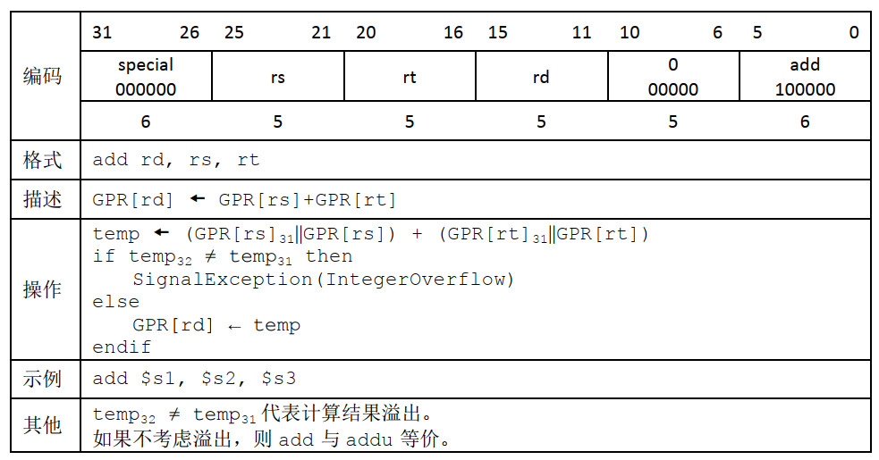
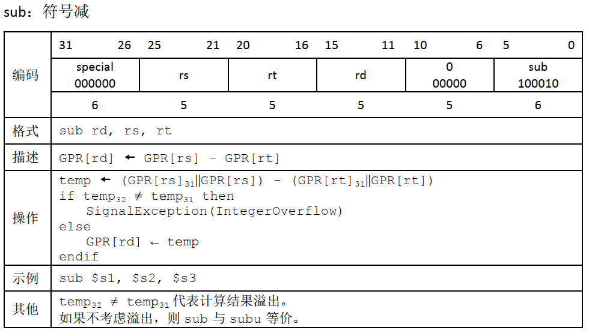
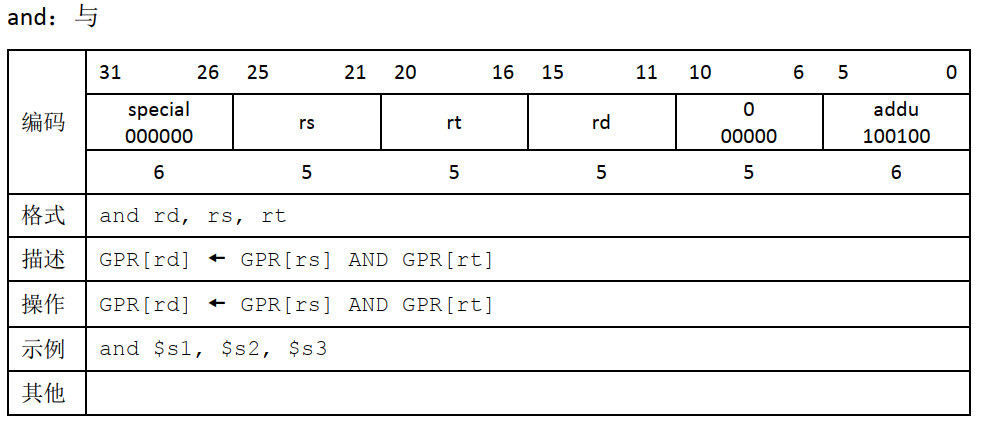
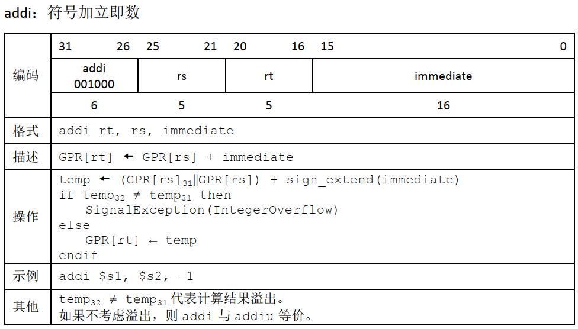
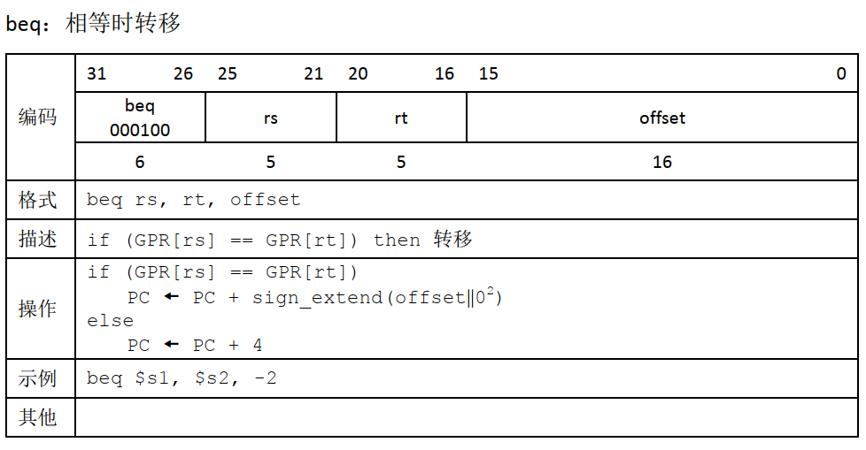
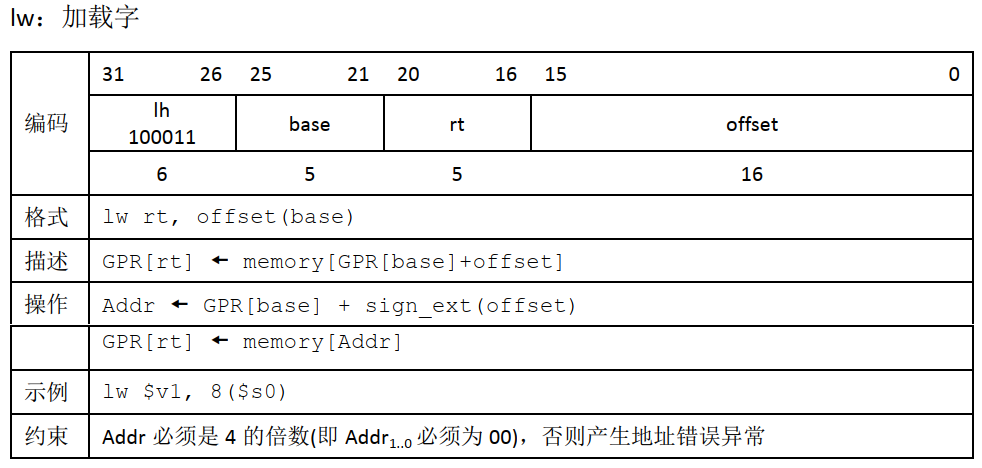
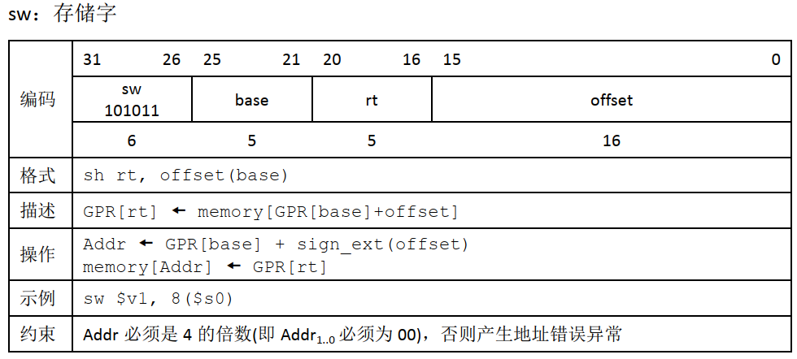

# 单周期 CPU 设计

从 MIPS-C 指令集中选择了 10 条，**地址总线** 和 **数据总线** 均为 32 位

## 指令选择

### R-R 运算指令 4 条

```assembly
add
sub
and
or
```








### R-I 运算指令 2 条

```assembly
addi
ori
```




### 分支指令 2 条

```assembly
beq
j
```




### 加载指令 1 条

```assembly
lw
```



### 2.5 存储指令 1 条

```assembly
sw
```



（上图描述的有误，我的代码实现是 `GPR[rt] -> memory[GPR[base]+offset]`）

## 表格汇总

| 文件                | 功能                         | 是否 OK             |
| ------------------- | ---------------------------- | ------------------- |
| defines.v           | 一些常量的定义               | :heavy_check_mark:  |
| pc.v                | 程序计数器                   | :heavy_check_mark:  |
| mux2.v              | 二路选择器                   | :heavy_check_mark:  |
| sign_extender.v     | 有符号数扩展（16位 -> 32位） | :heavy_check_mark:  |
| alu.v               | alu 运算单元                 | :heavy_check_mark:  |
| register_file.v     | 寄存器定义，初始清零         | :heavy_check_mark:  |
| inst_memory.v       | 指令定义，硬编码测试指令     | :heavy_check_mark:/​ |
| data_memory.v       | 数据定义，初始内存清零       | :heavy_check_mark:  |
| control_unit.v      | 分析指令                     | :heavy_check_mark:  |
| single_period_cpu.v | 内部信号连接                 | :heavy_check_mark:  |

## 测试指令

```assembly
ori  $r0, $r0, 0    // 占位
addi $r0, $r1, 1    // 把 $r1 设为 0+1, $r1 期望为 1
ori  $r0, $r2, 2    // 把 $r2 设为 0|2, $r2 期望为 2
add  $r1, $r2, $r3  // 把 $r3 设为 $r1+$r2, $r3 期望为 3
sub  $r2, $r1, $r4  // 把 $r4 设为 $r2-$r1, $r4 期望为 1
beq  $r3, $r4, 4    // 比较 $r3 和 $r4, 期望不跳转, 执行下一条指令
or   $r1, $r2, $r5  // 把 $r5 设为 $r1|$r2, $r5 期望为 3
beq  $r3, $r5, 2    // 比较 $r3 和 $r5, 期望跳转, 跳过下一条指令
j    0              // 跳转到开头, 期望被跳过, 不执行
j    11             // 期望跳过下一条指令
j    0              // 跳转到开头, 期望被跳过, 不执行
and  $r5, $r1, $r6  // 把 $r6 设为 $r5&$r1, $r6 期望为 1
beq  $r1, $r6, 3    // 比较 $r1 和 $r6, 期望跳转, 跳过下两条指令
j    0              // 跳转到开头, 期望被跳过, 不执行
j    0              // 跳转到开头, 期望被跳过, 不执行
sw   $r1, $r6, 15   // 把 $r6 存到 mem[$r1+15], 期望在 0x04 处写入 1
lw   $r7, $r5, 13   // 把 $r7 设为 mem[$r5+13], $r7 期望为 1
```

翻译成二进制

```verilog
inst_mem[0]  = 32'b001101_00000_00000_0000_0000_0000_0000;
inst_mem[1]  = 32'b001000_00000_00001_0000_0000_0000_0001;
inst_mem[2]  = 32'b001101_00000_00010_0000_0000_0000_0010;
inst_mem[3]  = 32'b000000_00001_00010_00011_00000_100000;
inst_mem[4]  = 32'b000000_00010_00001_00100_00000_100010;
inst_mem[5]  = 32'b000100_00011_00100_0000_0000_0000_0100;
inst_mem[6]  = 32'b000000_00001_00010_00101_00000_100101;
inst_mem[7]  = 32'b000100_00011_00101_0000_0000_0000_0010;
inst_mem[8]  = 32'b000010_0000_0000_0000_0000_0000_0000_00;
inst_mem[9]  = 32'b000010_0000_0000_0000_0000_0000_0010_11;
inst_mem[10] = 32'b000010_0000_0000_0000_0000_0000_0000_00;
inst_mem[11] = 32'b000000_00101_00001_00110_00000_100100;
inst_mem[12] = 32'b000100_00001_00110_0000_0000_0000_0011;
inst_mem[13] = 32'b000010_0000_0000_0000_0000_0000_0000_00;
inst_mem[14] = 32'b000010_0000_0000_0000_0000_0000_0000_00;
inst_mem[15] = 32'b101011_00001_00110_0000_0000_0000_1111;
inst_mem[16] = 32'b100011_00111_00101_0000_0000_0000_1101;
```


