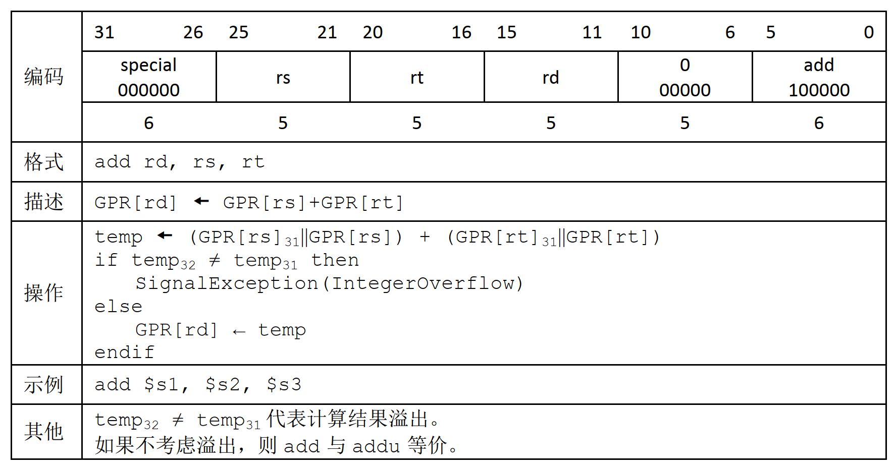
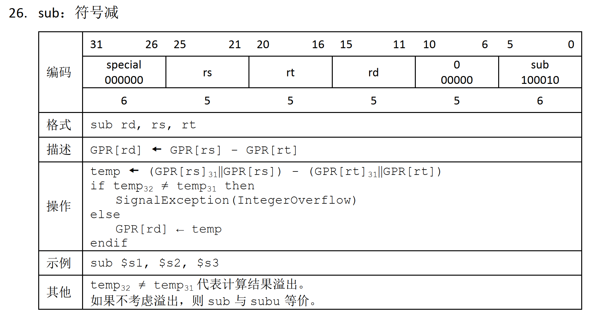
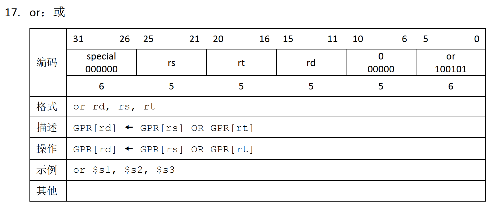
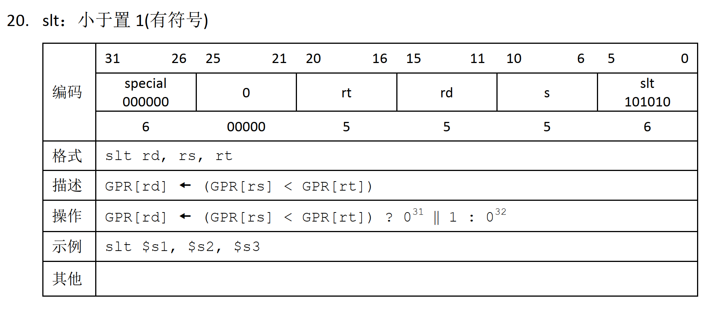
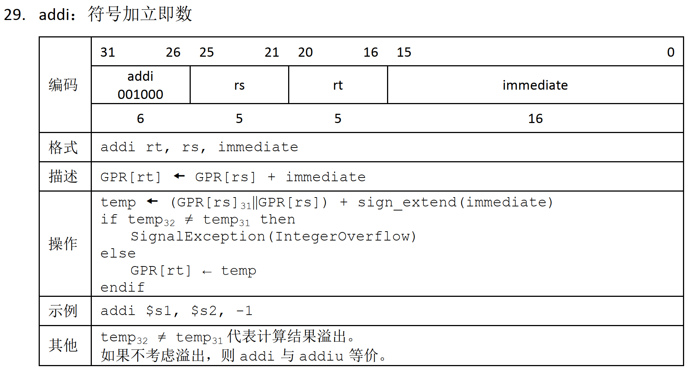
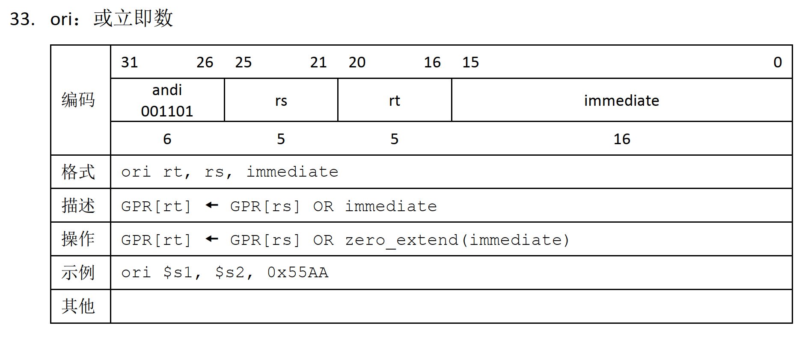
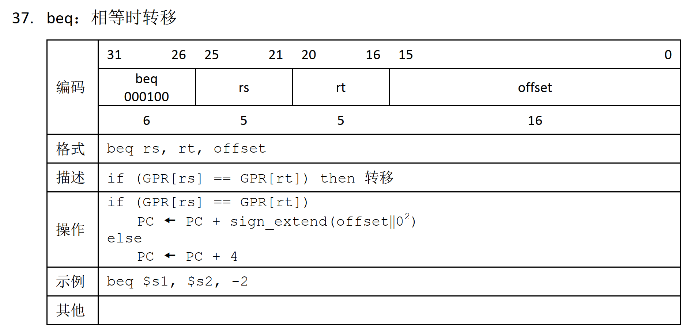
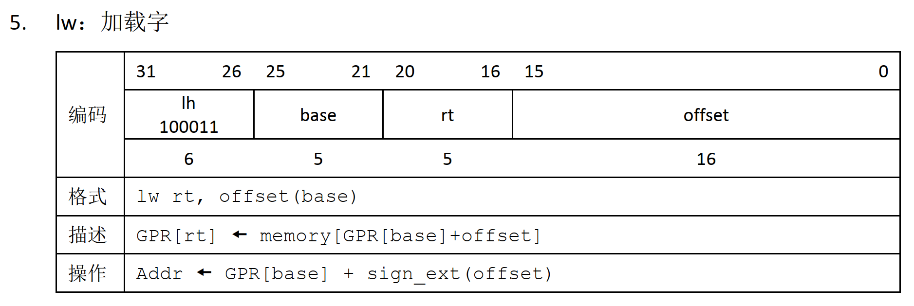
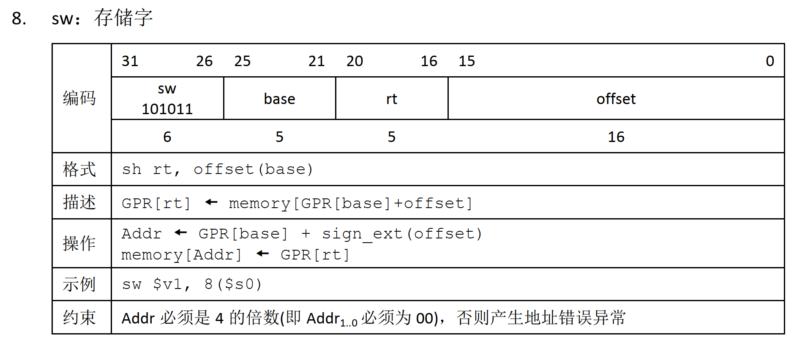

# 单周期 CPU 设计

单周期 CPU 指的是一条指令的执行在一个时钟周期内完成，然后开始下一条指令的执行，即一条指令用一个时钟周期完成。

**地址总线**和**数据总线**均为 32 位

## 指令选取

从 MIPS-C 指令集中进行选择，因此每条指令为 32 位

### R-R 运算指令 10 条

```assembly
add    # 加
sub    # 减
and    # 与
or     # 或
xor    # 异或
sll    # 逻辑左移
srl    # 逻辑右移
sra    # 算术右移
slt    # 带符号小于置 1
sltu   # 无符号小于置 1
```

### R-I 运算指令 2 条

```assembly
addi   # 加立即数
ori    # 或立即数
```

### 分支指令 2 条

```assembly
beq    # 等于转移
j      # 无条件跳转
```

### 加载指令 1 条

```assembly
lw    # 加载字
```

### 存储指令 1 条

```assembly
sw    # 存储字
```

## 指令设计

对这 10 条指令，每条都按照 MIPS-C 给出的来设计

### ADD



### SUB



### AND


### OR



### SLT



### ADDI



### ORI



### BEQ



### LW



### SW



## 模块设计

### 1. 程序计数器 (pc.v)

**功能**：负责存储当前执行指令的地址，并在时钟上升沿更新为下一条指令的地址。

**接口**：

- `clk`：时钟输入
- `rst`：复位输入，高电平有效
- `pc_next`：下一条指令的地址输入
- `pc_out`：当前指令的地址输出

**内部实现**：

- 一个 32 位寄存器，在时钟上升沿更新
- 复位时将 PC 置为 0

### 2. 指令存储器 (inst_mem.v)

**功能**：存储指令，根据 PC 提供的地址输出相应的指令。

**接口**：
- `addr`：指令地址输入
- `inst`：指令输出

**内部实现**：

- 256 个 32 位存储单元
- 从 `instructions.mem` 文件中初始化
- 字对齐访问，忽略地址的低 2 位

### 3. 寄存器堆 (reg_file.v)

**功能**：包含 32 个 32 位寄存器，用于存储操作数和结果。

**接口**：

- `clk`：时钟输入
- `we3`：写使能输入
- `ra1`：读端口 1 的寄存器地址
- `ra2`：读端口 2 的寄存器地址
- `wa3`：写端口的寄存器地址
- `wd3`：写数据输入
- `rd1`：读端口 1 的数据输出
- `rd2`：读端口 2 的数据输出

**内部实现**：

- 32 个 32 位寄存器
- $zero 寄存器始终为 0，不可写入
- 写操作在时钟上升沿触发
- 读操作是组合逻辑

### 4. ALU (alu.v)

**功能**：执行各种算术和逻辑运算。

**接口**：

- `a`：输入操作数 1
- `b`：输入操作数 2
- `alu_control`：ALU 控制信号
- `result`：运算结果输出
- `zero`：零标志位输出，运算结果为 0 时置 1

**ALU 控制信号**：
| 控制信号 | 功能 |
|---------|------|
| 0000 | ADD - 加法 |
| 0001 | SUB - 减法 |
| 0010 | AND - 与 |
| 0011 | OR - 或 |
| 0100 | XOR - 异或 |
| 0101 | SLL - 逻辑左移 |
| 0110 | SRL - 逻辑右移 |
| 0111 | SRA - 算术右移 |
| 1000 | SLT - 小于置 1 |
| 1001 | SLTU - 无符号小于置 1 |

### 5. 数据存储器 (data_mem.v)

**功能**：用于存储和读取数据，支持 LW（加载）和 SW（存储）指令。

**接口**：
- `clk`：时钟输入
- `we`：写使能输入
- `addr`：数据地址输入
- `wd`：写数据输入
- `rd`：读数据输出

**内部实现**：

- 256 个 32 位存储单元
- 从 `data.mem` 文件中初始化
- 写操作在时钟上升沿触发
- 读操作是组合逻辑
- 字对齐访问，忽略地址的低 2 位

### 6. 控制单元 (control.v)

**功能**：根据指令的操作码和功能码生成各种控制信号，协调 CPU 各组件的工作。

**接口**：

- `opcode`：指令的操作码（31-26 位）
- `funct`：R 型指令的功能码（5-0 位）
- `reg_dst`：寄存器目标选择信号
- `jump`：跳转信号
- `branch`：分支信号
- `mem_read`：存储器读信号
- `mem_to_reg`：存储器到寄存器信号
- `alu_op`：ALU 操作信号
- `mem_write`：存储器写信号
- `alu_src`：ALU 源选择信号
- `reg_write`：寄存器写信号

**指令操作码**：

| 指令类型 | 操作码 |
|---------|--------|
| R 型 | 000000 |
| LW | 100011 |
| SW | 101011 |
| BEQ | 000100 |
| ADDI | 001000 |
| ORI | 001101 |

**R 型指令功能码**：
| 指令 | 功能码 |
|------|--------|
| ADD | 100000 |
| SUB | 100010 |
| AND | 100100 |
| OR | 100101 |
| XOR | 100110 |
| SLL | 000000 |
| SRL | 000010 |
| SRA | 000011 |
| SLT | 101010 |
| SLTU | 101011 |

### 7. 顶层 CPU 模块 (single_cycle_cpu.v)

**功能**：将所有组件连接起来，形成完整的单周期 CPU 架构。

**接口**：
- `clk`：时钟输入
- `rst`：复位输入

**内部信号**：
- PC 相关：`pc_out`, `pc_next`, `pc_plus4`, `jump_addr`, `branch_addr`, `branch_target`, `branch_plus4`, `branch_taken`
- 指令相关：`inst`
- 寄存器堆相关：`rd1`, `rd2`, `write_reg`, `write_data`
- ALU 相关：`alu_in1`, `alu_in2`, `alu_out`, `zero`
- 立即数扩展：`sign_extended`
- 存储器相关：`mem_read_data`
- 控制信号：`reg_dst`, `jump`, `branch`, `mem_read`, `mem_to_reg`, `alu_op`, `mem_write`, `alu_src`, `reg_write`

## 指令执行流程

### 1. ADD 指令（R 型）

**指令格式**：`add $rd, $rs, $rt`  000000 rs rt rd 00000 100000

**控制信号**：

| 信号 | 值 |
|------|-----|
| reg_dst | 1 |
| jump | 0 |
| branch | 0 |
| mem_read | 0 |
| mem_to_reg | 0 |
| alu_op | 0000 (ADD) |
| mem_write | 0 |
| alu_src | 0 |
| reg_write | 1 |

**执行流程**：

1. 从 PC 取出指令
2. 读取 `$rs` 和 `$rt` 寄存器的值
3. ALU 执行加法操作：`$rs + $rt`
4. 将结果写入 `$rd` 寄存器
5. PC 加 4，指向下一条指令

### 2. SUB 指令（R 型）

**指令格式**：`sub $rd, $rs, $rt`  000000 rs rt rd 00000 100010

**控制信号**：
| 信号 | 值 |
|------|-----|
| reg_dst | 1 |
| jump | 0 |
| branch | 0 |
| mem_read | 0 |
| mem_to_reg | 0 |
| alu_op | 0001 (SUB) |
| mem_write | 0 |
| alu_src | 0 |
| reg_write | 1 |

**执行流程**：
1. 从 PC 取出指令
2. 读取 `$rs` 和 `$rt` 寄存器的值
3. ALU 执行减法操作：`$rs - $rt`
4. 将结果写入 `$rd` 寄存器
5. PC 加 4，指向下一条指令

### 3. AND 指令（R 型）

**指令格式**：`and $rd, $rs, $rt`  000000 rs rt rd 00000 100100

**控制信号**：
| 信号 | 值 |
|------|-----|
| reg_dst | 1 |
| jump | 0 |
| branch | 0 |
| mem_read | 0 |
| mem_to_reg | 0 |
| alu_op | 0010 (AND) |
| mem_write | 0 |
| alu_src | 0 |
| reg_write | 1 |

**执行流程**：
1. 从 PC 取出指令
2. 读取 `$rs` 和 `$rt` 寄存器的值
3. ALU 执行与操作：`$rs & $rt`
4. 将结果写入 `$rd` 寄存器
5. PC 加 4，指向下一条指令

### 4. OR 指令（R 型）

**指令格式**：`or $rd, $rs, $rt`  000000 rs rt rd 00000 100101

**控制信号**：
| 信号 | 值 |
|------|-----|
| reg_dst | 1 |
| jump | 0 |
| branch | 0 |
| mem_read | 0 |
| mem_to_reg | 0 |
| alu_op | 0011 (OR) |
| mem_write | 0 |
| alu_src | 0 |
| reg_write | 1 |

**执行流程**：
1. 从 PC 取出指令
2. 读取 `$rs` 和 `$rt` 寄存器的值
3. ALU 执行或操作：`$rs | $rt`
4. 将结果写入 `$rd` 寄存器
5. PC 加 4，指向下一条指令

### 5. SLT 指令（R 型）

**指令格式**：`slt $rd, $rs, $rt`  000000 rs rt rd 00000 101010

**控制信号**：
| 信号 | 值 |
|------|-----|
| reg_dst | 1 |
| jump | 0 |
| branch | 0 |
| mem_read | 0 |
| mem_to_reg | 0 |
| alu_op | 1000 (SLT) |
| mem_write | 0 |
| alu_src | 0 |
| reg_write | 1 |

**执行流程**：
1. 从 PC 取出指令
2. 读取 `$rs` 和 `$rt` 寄存器的值
3. ALU 执行小于比较：如果 `$rs < $rt`，结果为 1，否则为 0
4. 将结果写入 `$rd` 寄存器
5. PC 加 4，指向下一条指令

### 6. ADDI 指令（I 型）

**指令格式**：`addi $rt, $rs, imm`  001000 rs rt imm16

**控制信号**：
| 信号 | 值 |
|------|-----|
| reg_dst | 0 |
| jump | 0 |
| branch | 0 |
| mem_read | 0 |
| mem_to_reg | 0 |
| alu_op | 0000 (ADD) |
| mem_write | 0 |
| alu_src | 1 |
| reg_write | 1 |

**执行流程**：
1. 从 PC 取出指令
2. 读取 `$rs` 寄存器的值
3. 对立即数进行符号扩展
4. ALU 执行加法操作：`$rs + 扩展后的立即数`
5. 将结果写入 `$rt` 寄存器
6. PC 加 4，指向下一条指令

### 7. ORI 指令（I 型）

**指令格式**：`ori $rt, $rs, imm`  001101 rs rt imm16

**控制信号**：
| 信号 | 值 |
|------|-----|
| reg_dst | 0 |
| jump | 0 |
| branch | 0 |
| mem_read | 0 |
| mem_to_reg | 0 |
| alu_op | 0011 (OR) |
| mem_write | 0 |
| alu_src | 1 |
| reg_write | 1 |

**执行流程**：
1. 从 PC 取出指令
2. 读取 `$rs` 寄存器的值
3. 对立即数进行零扩展
4. ALU 执行或操作：`$rs | 扩展后的立即数`
5. 将结果写入 `$rt` 寄存器
6. PC 加 4，指向下一条指令

### 8. BEQ 指令（I 型）

**指令格式**：`beq $rs, $rt, label`  000100 rs rt imm16

**控制信号**：
| 信号 | 值 |
|------|-----|
| reg_dst | 0 |
| jump | 0 |
| branch | 1 |
| mem_read | 0 |
| mem_to_reg | 0 |
| alu_op | 0001 (SUB) |
| mem_write | 0 |
| alu_src | 0 |
| reg_write | 0 |

**执行流程**：
1. 从 PC 取出指令
2. 读取 `$rs` 和 `$rt` 寄存器的值
3. ALU 执行减法操作：`$rs - $rt`
4. 如果结果为 0（`$rs == $rt`），则 PC 跳转到目标地址：`PC + 4 + (imm16 << 2)`
5. 否则，PC 加 4，指向下一条指令

### 9. LW 指令（I 型）

**指令格式**：`lw $rt, imm($rs)`  100011 rs rt imm16

**控制信号**：
| 信号 | 值 |
|------|-----|
| reg_dst | 0 |
| jump | 0 |
| branch | 0 |
| mem_read | 1 |
| mem_to_reg | 1 |
| alu_op | 0000 (ADD) |
| mem_write | 0 |
| alu_src | 1 |
| reg_write | 1 |

**执行流程**：
1. 从 PC 取出指令
2. 读取 `$rs` 寄存器的值
3. 对立即数进行符号扩展
4. ALU 计算内存地址：`$rs + 扩展后的立即数`
5. 从数据存储器中读取该地址的数据
6. 将读取的数据写入 `$rt` 寄存器
7. PC 加 4，指向下一条指令

### 10. SW 指令（I 型）

**指令格式**：`sw $rt, imm($rs)`  101011 rs rt imm16

**控制信号**：
| 信号 | 值 |
|------|-----|
| reg_dst | 0 |
| jump | 0 |
| branch | 0 |
| mem_read | 0 |
| mem_to_reg | 0 |
| alu_op | 0000 (ADD) |
| mem_write | 1 |
| alu_src | 1 |
| reg_write | 0 |

**执行流程**：
1. 从 PC 取出指令
2. 读取 `$rs` 和 `$rt` 寄存器的值
3. 对立即数进行符号扩展
4. ALU 计算内存地址：`$rs + 扩展后的立即数`
5. 将 `$rt` 寄存器的值写入该内存地址
6. PC 加 4，指向下一条指令

## 测试文件

### 1. instructions.mem

包含 10 条测试指令：

```
20010001  # addi $1, $0, 1
20020002  # addi $2, $0, 2
00221820  # add $3, $1, $2
00222022  # sub $4, $1, $2
00222824  # and $5, $1, $2
00223025  # or $6, $1, $2
0022382a  # slt $7, $1, $2
8c440000  # lw $4, 0($2)
ac640000  # sw $4, 0($3)
10220001  # beq $1, $2, 4
```

### 2. data.mem

包含初始数据：

```
00000004  # 地址 0x00000000
00000005  # 地址 0x00000004
00000006  # 地址 0x00000008
00000007  # 地址 0x0000000C
```

## 设计文件说明

| 文件名 | 功能 |
|--------|------|
| pc.v | 程序计数器 |
| inst_mem.v | 指令存储器 |
| reg_file.v | 寄存器堆 |
| alu.v | 算术逻辑单元 |
| data_mem.v | 数据存储器 |
| control.v | 控制单元 |
| single_cycle_cpu.v | 顶层 CPU 模块 |
| testbench.v | 测试基准 |
| instructions.mem | 测试指令文件 |
| data.mem | 测试数据文件 |

## 总结

本设计实现了一个基于 MIPS 指令集的单周期 CPU，支持 16 条基本指令：
- 10 条 R 型运算指令：ADD、SUB、AND、OR、XOR、SLL、SRL、SRA、SLT、SLTU
- 2 条 I 型运算指令：ADDI、ORI
- 2 条分支指令：BEQ、J
- 1 条加载指令：LW
- 1 条存储指令：SW

单周期 CPU 的特点是一条指令在一个时钟周期内完成，设计简单，易于理解，但效率较低，因为所有指令都需要相同的时钟周期，无论指令的复杂度如何。

该设计包括了 CPU 的核心组件：程序计数器、指令存储器、控制单元、寄存器堆、ALU 和数据存储器，并提供了完整的测试基准和测试文件，可以通过仿真验证 CPU 的功能。